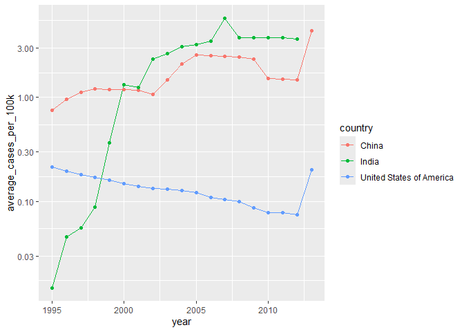
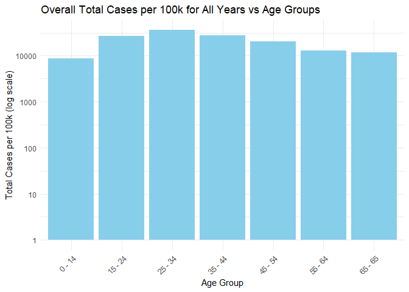
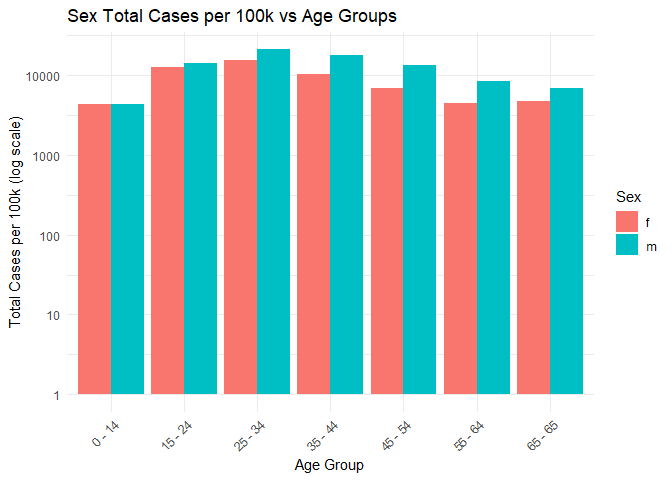
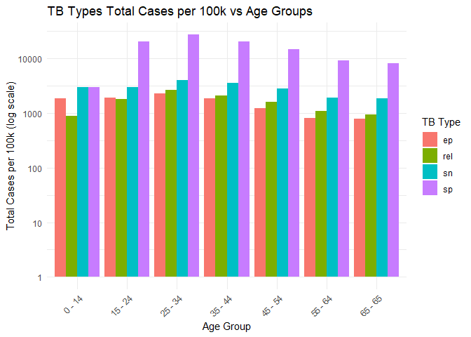
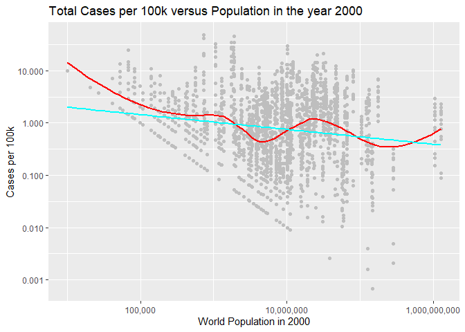

## Introduction

### In this formative assessment, you will review Unit 1, focusing on data wrangling, manipulation, and visualization.

    library(tidyverse)

    ## ── Attaching core tidyverse packages ──────────────────────── tidyverse 2.0.0 ──
    ## ✔ dplyr     1.1.4     ✔ readr     2.1.5
    ## ✔ forcats   1.0.0     ✔ stringr   1.5.1
    ## ✔ ggplot2   3.5.1     ✔ tibble    3.2.1
    ## ✔ lubridate 1.9.4     ✔ tidyr     1.3.1
    ## ✔ purrr     1.0.2     
    ## ── Conflicts ────────────────────────────────────────── tidyverse_conflicts() ──
    ## ✖ dplyr::filter() masks stats::filter()
    ## ✖ dplyr::lag()    masks stats::lag()
    ## ℹ Use the conflicted package (<http://conflicted.r-lib.org/>) to force all conflicts to become errors

You will perform a data analysis to study trends in tuberculosis (TB)
cases worldwide over time. The two relevant datasets are:

-   `who.tsv`: Information about TB cases in various countries from 1980
    to 2013 (Source: 2014 WHO Global Tuberculosis Report).

<!-- -->

    # A subset of data from the World Health Organization Global Tuberculosis Report, and accompanying global populations. who uses the original codes from the World Health Organization.
    data("who")

-   `population.csv`: Population data of each country across time
    (Source: The World Bank).

<!-- -->

    # A subset of data from the World Health Organization Global Tuberculosis Report, and accompanying global populations. who uses the original codes from the World Health Organization. 
    data("population")

## Import

### 2.1. Preview the contents of `who.tsv` and `population.csv` by inspecting the files.

> Reference: <https://bookdown.org/rwnahhas/IntroToR/inspect.html>

    head(who)

    ## # A tibble: 6 × 60
    ##   country   iso2  iso3   year new_sp_m014 new_sp_m1524 new_sp_m2534 new_sp_m3544
    ##   <chr>     <chr> <chr> <dbl>       <dbl>        <dbl>        <dbl>        <dbl>
    ## 1 Afghanis… AF    AFG    1980          NA           NA           NA           NA
    ## 2 Afghanis… AF    AFG    1981          NA           NA           NA           NA
    ## 3 Afghanis… AF    AFG    1982          NA           NA           NA           NA
    ## 4 Afghanis… AF    AFG    1983          NA           NA           NA           NA
    ## 5 Afghanis… AF    AFG    1984          NA           NA           NA           NA
    ## 6 Afghanis… AF    AFG    1985          NA           NA           NA           NA
    ## # ℹ 52 more variables: new_sp_m4554 <dbl>, new_sp_m5564 <dbl>,
    ## #   new_sp_m65 <dbl>, new_sp_f014 <dbl>, new_sp_f1524 <dbl>,
    ## #   new_sp_f2534 <dbl>, new_sp_f3544 <dbl>, new_sp_f4554 <dbl>,
    ## #   new_sp_f5564 <dbl>, new_sp_f65 <dbl>, new_sn_m014 <dbl>,
    ## #   new_sn_m1524 <dbl>, new_sn_m2534 <dbl>, new_sn_m3544 <dbl>,
    ## #   new_sn_m4554 <dbl>, new_sn_m5564 <dbl>, new_sn_m65 <dbl>,
    ## #   new_sn_f014 <dbl>, new_sn_f1524 <dbl>, new_sn_f2534 <dbl>, …

    head(population)

    ## # A tibble: 6 × 3
    ##   country      year population
    ##   <chr>       <dbl>      <dbl>
    ## 1 Afghanistan  1995   17586073
    ## 2 Afghanistan  1996   18415307
    ## 3 Afghanistan  1997   19021226
    ## 4 Afghanistan  1998   19496836
    ## 5 Afghanistan  1999   19987071
    ## 6 Afghanistan  2000   20595360

### 2.2. Import the data into tibbles named `who` and `population`

> Already performed and saved these datasets within local R environment
> from the Introduction stage above: as `who` and `population`
> respectively

### 2.3. Determine the number of rows and columns in each tibble.

    # dim(x) = check the current dimension of the provided dataset 
    # to inspect and determine the number of observations (rows) and variables present (columns) on each dataset
    dim(who) # [1]

    ## [1] 7240   60

    dim(population) # [2]

    ## [1] 4060    3

    # lapply(x, y) = determine the types of each variable and generate its results as a list (arrays of characters)
    # unlist(x) =  it converts the output list into a vector preview

    unlist(lapply(who, class))

    ##      country         iso2         iso3         year  new_sp_m014 new_sp_m1524 
    ##  "character"  "character"  "character"    "numeric"    "numeric"    "numeric" 
    ## new_sp_m2534 new_sp_m3544 new_sp_m4554 new_sp_m5564   new_sp_m65  new_sp_f014 
    ##    "numeric"    "numeric"    "numeric"    "numeric"    "numeric"    "numeric" 
    ## new_sp_f1524 new_sp_f2534 new_sp_f3544 new_sp_f4554 new_sp_f5564   new_sp_f65 
    ##    "numeric"    "numeric"    "numeric"    "numeric"    "numeric"    "numeric" 
    ##  new_sn_m014 new_sn_m1524 new_sn_m2534 new_sn_m3544 new_sn_m4554 new_sn_m5564 
    ##    "numeric"    "numeric"    "numeric"    "numeric"    "numeric"    "numeric" 
    ##   new_sn_m65  new_sn_f014 new_sn_f1524 new_sn_f2534 new_sn_f3544 new_sn_f4554 
    ##    "numeric"    "numeric"    "numeric"    "numeric"    "numeric"    "numeric" 
    ## new_sn_f5564   new_sn_f65  new_ep_m014 new_ep_m1524 new_ep_m2534 new_ep_m3544 
    ##    "numeric"    "numeric"    "numeric"    "numeric"    "numeric"    "numeric" 
    ## new_ep_m4554 new_ep_m5564   new_ep_m65  new_ep_f014 new_ep_f1524 new_ep_f2534 
    ##    "numeric"    "numeric"    "numeric"    "numeric"    "numeric"    "numeric" 
    ## new_ep_f3544 new_ep_f4554 new_ep_f5564   new_ep_f65  newrel_m014 newrel_m1524 
    ##    "numeric"    "numeric"    "numeric"    "numeric"    "numeric"    "numeric" 
    ## newrel_m2534 newrel_m3544 newrel_m4554 newrel_m5564   newrel_m65  newrel_f014 
    ##    "numeric"    "numeric"    "numeric"    "numeric"    "numeric"    "numeric" 
    ## newrel_f1524 newrel_f2534 newrel_f3544 newrel_f4554 newrel_f5564   newrel_f65 
    ##    "numeric"    "numeric"    "numeric"    "numeric"    "numeric"    "numeric"

    unlist(lapply(population, class))

    ##     country        year  population 
    ## "character"   "numeric"   "numeric"

### 2.4. Check the summary of variable types for `population.csv`. Fix any anomalies and store the corrected data in `population2`.

    # Display the summary of variable types
    summary(population)

    ##    country               year        population       
    ##  Length:4060        Min.   :1995   Min.   :1.129e+03  
    ##  Class :character   1st Qu.:1999   1st Qu.:6.029e+05  
    ##  Mode  :character   Median :2004   Median :5.319e+06  
    ##                     Mean   :2004   Mean   :3.003e+07  
    ##                     3rd Qu.:2009   3rd Qu.:1.855e+07  
    ##                     Max.   :2013   Max.   :1.386e+09

    # Fix any anomalies
    population <- population %>%
      mutate(
        year = as.numeric(year),
        population = as.numeric(population),
        country = as.character(country)
      )

    # Store the corrected data in population2
    population2 <- population
    population2

    ## # A tibble: 4,060 × 3
    ##    country      year population
    ##    <chr>       <dbl>      <dbl>
    ##  1 Afghanistan  1995   17586073
    ##  2 Afghanistan  1996   18415307
    ##  3 Afghanistan  1997   19021226
    ##  4 Afghanistan  1998   19496836
    ##  5 Afghanistan  1999   19987071
    ##  6 Afghanistan  2000   20595360
    ##  7 Afghanistan  2001   21347782
    ##  8 Afghanistan  2002   22202806
    ##  9 Afghanistan  2003   23116142
    ## 10 Afghanistan  2004   24018682
    ## # ℹ 4,050 more rows

## Tidy Data

### `who.tsv` dataset

> **Description of Columns**
>
> > `country`: Country name.
> >
> > `iso2`: Two-digit country code.
> >
> > `iso3`: Three-digit country code.
> >
> > `year`: Year
> >
> > Variables like `new_ep_f014`:
> >
> > > `ep`: TB type (e.g., rel = relapse, ep = extrapulmonary).
> > >
> > > `f`: Sex (e.g., f = female).
> > >
> > > `014`: Age group (e.g., 0-14 years).

### In the context of Tuberculosis (TB), these abbreviations refer to different types of cases based on the method of diagnosis:

-   SP (Smear Positive): Cases where the TB bacteria are detected in a
    sputum smear test.
-   SN (Smear Negative): Cases where the TB bacteria are not detected in
    a sputum smear test, but TB is diagnosed through other methods.
-   EP (Extrapulmonary): Cases where TB affects parts of the body other
    than the lungs, such as the lymph nodes, bones, or kidneys.
-   REL (Relapse): Cases where a patient who was previously treated for
    TB and declared cured or treatment completed is diagnosed with TB
    again

#### 3.1.1 Identify the variables in the dataset.

    unlist(lapply(who, class))

    ##      country         iso2         iso3         year  new_sp_m014 new_sp_m1524 
    ##  "character"  "character"  "character"    "numeric"    "numeric"    "numeric" 
    ## new_sp_m2534 new_sp_m3544 new_sp_m4554 new_sp_m5564   new_sp_m65  new_sp_f014 
    ##    "numeric"    "numeric"    "numeric"    "numeric"    "numeric"    "numeric" 
    ## new_sp_f1524 new_sp_f2534 new_sp_f3544 new_sp_f4554 new_sp_f5564   new_sp_f65 
    ##    "numeric"    "numeric"    "numeric"    "numeric"    "numeric"    "numeric" 
    ##  new_sn_m014 new_sn_m1524 new_sn_m2534 new_sn_m3544 new_sn_m4554 new_sn_m5564 
    ##    "numeric"    "numeric"    "numeric"    "numeric"    "numeric"    "numeric" 
    ##   new_sn_m65  new_sn_f014 new_sn_f1524 new_sn_f2534 new_sn_f3544 new_sn_f4554 
    ##    "numeric"    "numeric"    "numeric"    "numeric"    "numeric"    "numeric" 
    ## new_sn_f5564   new_sn_f65  new_ep_m014 new_ep_m1524 new_ep_m2534 new_ep_m3544 
    ##    "numeric"    "numeric"    "numeric"    "numeric"    "numeric"    "numeric" 
    ## new_ep_m4554 new_ep_m5564   new_ep_m65  new_ep_f014 new_ep_f1524 new_ep_f2534 
    ##    "numeric"    "numeric"    "numeric"    "numeric"    "numeric"    "numeric" 
    ## new_ep_f3544 new_ep_f4554 new_ep_f5564   new_ep_f65  newrel_m014 newrel_m1524 
    ##    "numeric"    "numeric"    "numeric"    "numeric"    "numeric"    "numeric" 
    ## newrel_m2534 newrel_m3544 newrel_m4554 newrel_m5564   newrel_m65  newrel_f014 
    ##    "numeric"    "numeric"    "numeric"    "numeric"    "numeric"    "numeric" 
    ## newrel_f1524 newrel_f2534 newrel_f3544 newrel_f4554 newrel_f5564   newrel_f65 
    ##    "numeric"    "numeric"    "numeric"    "numeric"    "numeric"    "numeric"

#### 3.1.2 Perform a pivot operation to make the data tidy, storing the result in `who2`.

    who2 <- who %>%
      pivot_longer(cols = starts_with("new"),
                   names_to = "key",
                   values_to = "cases",
                   values_drop_na = TRUE)
    who2

    ## # A tibble: 76,046 × 6
    ##    country     iso2  iso3   year key          cases
    ##    <chr>       <chr> <chr> <dbl> <chr>        <dbl>
    ##  1 Afghanistan AF    AFG    1997 new_sp_m014      0
    ##  2 Afghanistan AF    AFG    1997 new_sp_m1524    10
    ##  3 Afghanistan AF    AFG    1997 new_sp_m2534     6
    ##  4 Afghanistan AF    AFG    1997 new_sp_m3544     3
    ##  5 Afghanistan AF    AFG    1997 new_sp_m4554     5
    ##  6 Afghanistan AF    AFG    1997 new_sp_m5564     2
    ##  7 Afghanistan AF    AFG    1997 new_sp_m65       0
    ##  8 Afghanistan AF    AFG    1997 new_sp_f014      5
    ##  9 Afghanistan AF    AFG    1997 new_sp_f1524    38
    ## 10 Afghanistan AF    AFG    1997 new_sp_f2534    36
    ## # ℹ 76,036 more rows

#### 3.1.3 Separate values like `new_ep_f014` into components (e.g., `new`, `ep`, `f014`). Remove the column containing new, and store the result in `who3`.

    who3 <- who2 %>%
      separate(key, into = c("new", "type_sexage"), sep = "_", extra = "merge", fill = "right") %>%
      filter(!is.na(new) & !is.na(type_sexage)) %>%
      mutate(
        type_sexage = 
          if_else(
            condition = str_detect(new, "newrel"), 
            true = paste0("rel_", type_sexage), 
            false = type_sexage
            ),
        new = 
          if_else(
            condition = str_detect(new, "newrel"),
            true = "new",
            false = new
            )
      ) %>%
      separate(type_sexage, into=c("tuberculosis_type", "sexage"), sep = "_") %>%
      select(-new)
      

    who3

    ## # A tibble: 76,046 × 7
    ##    country     iso2  iso3   year tuberculosis_type sexage cases
    ##    <chr>       <chr> <chr> <dbl> <chr>             <chr>  <dbl>
    ##  1 Afghanistan AF    AFG    1997 sp                m014       0
    ##  2 Afghanistan AF    AFG    1997 sp                m1524     10
    ##  3 Afghanistan AF    AFG    1997 sp                m2534      6
    ##  4 Afghanistan AF    AFG    1997 sp                m3544      3
    ##  5 Afghanistan AF    AFG    1997 sp                m4554      5
    ##  6 Afghanistan AF    AFG    1997 sp                m5564      2
    ##  7 Afghanistan AF    AFG    1997 sp                m65        0
    ##  8 Afghanistan AF    AFG    1997 sp                f014       5
    ##  9 Afghanistan AF    AFG    1997 sp                f1524     38
    ## 10 Afghanistan AF    AFG    1997 sp                f2534     36
    ## # ℹ 76,036 more rows

#### 3.1.4 Further separate values like `f014` into `f` and `014`, storing the result in `who_tidy`.

    who_tidy <- who3 %>%
      separate(sexage, into = c("sex", "age"), sep = 1) %>%
      separate(age, into = c("age_from", "age_until"), sep = -2) %>%
      mutate(
        age_from = as.numeric(age_from),  # Ensure age_from is numeric
        age_until = as.numeric(age_until), # Ensure age_until is numeric
        age_from = 
          if_else(
            condition = age_until == 65,  # Directly compare age_until with 65
            true = 65,
            false = age_from
          )
        )
    who_tidy

    ## # A tibble: 76,046 × 9
    ##    country    iso2  iso3   year tuberculosis_type sex   age_from age_until cases
    ##    <chr>      <chr> <chr> <dbl> <chr>             <chr>    <dbl>     <dbl> <dbl>
    ##  1 Afghanist… AF    AFG    1997 sp                m            0        14     0
    ##  2 Afghanist… AF    AFG    1997 sp                m           15        24    10
    ##  3 Afghanist… AF    AFG    1997 sp                m           25        34     6
    ##  4 Afghanist… AF    AFG    1997 sp                m           35        44     3
    ##  5 Afghanist… AF    AFG    1997 sp                m           45        54     5
    ##  6 Afghanist… AF    AFG    1997 sp                m           55        64     2
    ##  7 Afghanist… AF    AFG    1997 sp                m           65        65     0
    ##  8 Afghanist… AF    AFG    1997 sp                f            0        14     5
    ##  9 Afghanist… AF    AFG    1997 sp                f           15        24    38
    ## 10 Afghanist… AF    AFG    1997 sp                f           25        34    36
    ## # ℹ 76,036 more rows

### `population.csv` Dataset

#### 3.2.1 Identify the variables in this dataset.

    unlist(lapply(population2, class))

    ##     country        year  population 
    ## "character"   "numeric"   "numeric"

#### 3.2.2 Perform a pivot operation to tidy the data, storing the result in `population3`.

    population3 <- population2 %>%
      pivot_wider(names_from = year,
                  values_from = population,
                  names_prefix = "population_")
    population3

    ## # A tibble: 219 × 20
    ##    country       population_1995 population_1996 population_1997 population_1998
    ##    <chr>                   <dbl>           <dbl>           <dbl>           <dbl>
    ##  1 Afghanistan          17586073        18415307        19021226        19496836
    ##  2 Albania               3357858         3341043         3331317         3325456
    ##  3 Algeria              29315463        29845208        30345466        30820435
    ##  4 American Sam…           52874           53926           54942           55899
    ##  5 Andorra                 63854           64274           64090           63799
    ##  6 Angola               12104952        12451945        12791388        13137542
    ##  7 Anguilla                 9807           10063           10305           10545
    ##  8 Antigua and …           68349           70245           72232           74206
    ##  9 Argentina            34833168        35264070        35690778        36109342
    ## 10 Armenia               3223173         3173425         3137652         3112958
    ## # ℹ 209 more rows
    ## # ℹ 15 more variables: population_1999 <dbl>, population_2000 <dbl>,
    ## #   population_2001 <dbl>, population_2002 <dbl>, population_2003 <dbl>,
    ## #   population_2004 <dbl>, population_2005 <dbl>, population_2006 <dbl>,
    ## #   population_2007 <dbl>, population_2008 <dbl>, population_2009 <dbl>,
    ## #   population_2010 <dbl>, population_2011 <dbl>, population_2012 <dbl>,
    ## #   population_2013 <dbl>

    # NOTE: PIVOTING WIDER the dataset population2 might be relevant to some data visualization which then stored as population3, however, no pivot_longer() operation that can be further done within population2, in contrast, after this code block, in order to properly perform left_join() between datasets who and population, the population2 is indeed the best tidy data for population already.

#### 3.2.3 Cast the population variable to an appropriate data type, storing the result in `population_tidy`.

    # population_tidy <- population3 %>%
    #  mutate_at(vars(starts_with("population_")), as.numeric)

    # answer for 3.2.3 is the - code block - comment above, however, we would rather use:
    population_tidy <- population2 # this one!

## Join Datasets

#### 3.3.1 Identify the variable(s) required to join who\_tidy and population\_tidy.

    print("Variables in who_tidy data:")

    ## [1] "Variables in who_tidy data:"

    unlist(lapply(who_tidy, class))

    ##           country              iso2              iso3              year 
    ##       "character"       "character"       "character"         "numeric" 
    ## tuberculosis_type               sex          age_from         age_until 
    ##       "character"       "character"         "numeric"         "numeric" 
    ##             cases 
    ##         "numeric"

    print("Variables in population_tidy data:")

    ## [1] "Variables in population_tidy data:"

    unlist(lapply(population_tidy, class))

    ##     country        year  population 
    ## "character"   "numeric"   "numeric"

 WE IDENTIFIED THAT ONLY ONE VARIABLE THAT CAN
BE JOIN BETWEEN DATASETS, PERFORMING THE LEFT\_JOIN FROM `who_tidy` TO
`population_tidy` with variable `year` as the key reference. 

#### 3.3.2 Rename columns as needed to align variable names between datasets.

    # No need to *rename* the mentioned columns since both datasets contain variable `year` already and as numeric datatype already

#### 3.3.3 Join the datasets into a tibble called `tuberculosis`.

    tuberculosis <- left_join(x = who_tidy, y = population_tidy, by = c("country", "year"))
    tuberculosis

    ## # A tibble: 76,046 × 10
    ##    country    iso2  iso3   year tuberculosis_type sex   age_from age_until cases
    ##    <chr>      <chr> <chr> <dbl> <chr>             <chr>    <dbl>     <dbl> <dbl>
    ##  1 Afghanist… AF    AFG    1997 sp                m            0        14     0
    ##  2 Afghanist… AF    AFG    1997 sp                m           15        24    10
    ##  3 Afghanist… AF    AFG    1997 sp                m           25        34     6
    ##  4 Afghanist… AF    AFG    1997 sp                m           35        44     3
    ##  5 Afghanist… AF    AFG    1997 sp                m           45        54     5
    ##  6 Afghanist… AF    AFG    1997 sp                m           55        64     2
    ##  7 Afghanist… AF    AFG    1997 sp                m           65        65     0
    ##  8 Afghanist… AF    AFG    1997 sp                f            0        14     5
    ##  9 Afghanist… AF    AFG    1997 sp                f           15        24    38
    ## 10 Afghanist… AF    AFG    1997 sp                f           25        34    36
    ## # ℹ 76,036 more rows
    ## # ℹ 1 more variable: population <dbl>

## Clean Up Data

#### 3.4.1 Remove unnecessary variables from `tuberculosis`.

#### 3.4.2 Filter out `NA` values

#### 3.4.3 Save the cleaned data back into `tuberculosis`.

    tuberculosis <- tuberculosis %>%
      select(-iso2, -iso3) %>%
      na.omit()
    tuberculosis

    ## # A tibble: 75,234 × 8
    ##    country      year tuberculosis_type sex   age_from age_until cases population
    ##    <chr>       <dbl> <chr>             <chr>    <dbl>     <dbl> <dbl>      <dbl>
    ##  1 Afghanistan  1997 sp                m            0        14     0   19021226
    ##  2 Afghanistan  1997 sp                m           15        24    10   19021226
    ##  3 Afghanistan  1997 sp                m           25        34     6   19021226
    ##  4 Afghanistan  1997 sp                m           35        44     3   19021226
    ##  5 Afghanistan  1997 sp                m           45        54     5   19021226
    ##  6 Afghanistan  1997 sp                m           55        64     2   19021226
    ##  7 Afghanistan  1997 sp                m           65        65     0   19021226
    ##  8 Afghanistan  1997 sp                f            0        14     5   19021226
    ##  9 Afghanistan  1997 sp                f           15        24    38   19021226
    ## 10 Afghanistan  1997 sp                f           25        34    36   19021226
    ## # ℹ 75,224 more rows

## Data Manipulation

### 4.1 Determine the total TB cases among men and women in the 21st century in the United States. Identify which sex had more cases.

    # total_tuberculosis_case_USA_by_sex <-
    tuberculosis %>%
      filter(
        country == "United States of America",
        year >= 2001
      ) %>%
      group_by(sex) %>%
      summarize(total_tubercolosis_cases_by_sex = sum(cases))

    ## # A tibble: 2 × 2
    ##   sex   total_tubercolosis_cases_by_sex
    ##   <chr>                           <dbl>
    ## 1 f                               43982
    ## 2 m                               73769

    print("The data summary above provides us the understanding that the United States of America [USA], since 2001 to 2013, had such many tubercolosis cases within male population than female population - about 1.68 males would have tubercolosis for every 1 female having this disease also (ratio 1.68:1) by then having total tubercolosis case by sex are as follows: 73,769 male, and 43,982 female within USA from 2001 - 2013")

    ## [1] "The data summary above provides us the understanding that the United States of America [USA], since 2001 to 2013, had such many tubercolosis cases within male population than female population - about 1.68 males would have tubercolosis for every 1 female having this disease also (ratio 1.68:1) by then having total tubercolosis case by sex are as follows: 73,769 male, and 43,982 female within USA from 2001 - 2013"

### 4.2 Create a new variable, `cases_per_100k`, representing TB cases per 100,000 people by year, sex, age group, and TB type.

    tuberculosis <- tuberculosis %>%
      mutate(
        cases_per_100k = (cases / population) * 10**5
      )

### 4.3 Identify:

#### The country and year with the highest cases per 100k.

    tuberculosis %>%
      filter(cases_per_100k == max(cases_per_100k))

    ## # A tibble: 1 × 9
    ##   country  year tuberculosis_type sex   age_from age_until cases population
    ##   <chr>   <dbl> <chr>             <chr>    <dbl>     <dbl> <dbl>      <dbl>
    ## 1 Samoa    2009 sp                f           65        65  1111     184704
    ## # ℹ 1 more variable: cases_per_100k <dbl>

    print("Highest Case of TB per 100k people: {Country: Samoa; Year: 2009} which signifies that very concerning amount of people would expected to get at least 601 TB cases for every 100,000 people considered within the population of Samoa")

    ## [1] "Highest Case of TB per 100k people: {Country: Samoa; Year: 2009} which signifies that very concerning amount of people would expected to get at least 601 TB cases for every 100,000 people considered within the population of Samoa"

#### The country and year with the lowest cases per 100k.

    tuberculosis %>%
      filter(cases_per_100k != 0) %>% # OUTLIERS  
      filter(cases_per_100k == min(cases_per_100k))

    ## # A tibble: 2 × 9
    ##   country       year tuberculosis_type sex   age_from age_until cases population
    ##   <chr>        <dbl> <chr>             <chr>    <dbl>     <dbl> <dbl>      <dbl>
    ## 1 Russian Fed…  2000 sp                m            0        14     1  146762881
    ## 2 Russian Fed…  2000 sp                f            0        14     1  146762881
    ## # ℹ 1 more variable: cases_per_100k <dbl>

    print("Lowest Case of TB per 100k people: {Country: Russian Federation; Year: 2000} which signifies that least concerning amount of people would even get at most 1 TB cases for every 200,000,000 people considered")

    ## [1] "Lowest Case of TB per 100k people: {Country: Russian Federation; Year: 2000} which signifies that least concerning amount of people would even get at most 1 TB cases for every 200,000,000 people considered"

## Data Visualization

### 5.1 Plot the total cases per 100k as a function of year for China, India, and the United States:

    # x-axis: time of the year
    # y-axis: total cases recorded per 100k people
    tb_visualization_1 <- tuberculosis %>%
      filter(country %in% c("China", "India", "United States of America")) %>%
      group_by(country, year) %>%
      summarise(average_cases_per_100k = mean(cases_per_100k))

    ## `summarise()` has grouped output by 'country'. You can override using the
    ## `.groups` argument.

    tb_visualization_1 %>%
      ggplot() +
      geom_line(mapping = aes(x = year, y = average_cases_per_100k, colour = country)) +
      geom_point(mapping = aes(x = year, y = average_cases_per_100k, colour = country)) +
      scale_y_log10()

    print("The figure above is the tubercolosis report from three distinct countries: China, India, and United States of America; the report has been done yearly particularly from 1995 to 2013. (1) China had some slow and steady consistent near 1 person of having tubercolosis for every 100k people. (2) India on the other hand, suffers from almost no cases in 1995 it has been logarithmictically outbreak to more than 4 people having TB cases for every 100k. Finally, (3) gradual improvement of slowstead down of average cases of TB per 100k within USA")

    ## [1] "The figure above is the tubercolosis report from three distinct countries: China, India, and United States of America; the report has been done yearly particularly from 1995 to 2013. (1) China had some slow and steady consistent near 1 person of having tubercolosis for every 100k people. (2) India on the other hand, suffers from almost no cases in 1995 it has been logarithmictically outbreak to more than 4 people having TB cases for every 100k. Finally, (3) gradual improvement of slowstead down of average cases of TB per 100k within USA"

### 5.2 Compare distributions of total cases per 100k (summed over years, sexes, and TB types) across age groups:

    # Create a new column for age group labels
    tuberculosis <- tuberculosis %>%
      mutate(age_group = paste(age_from, age_until, sep = " - "))

    # Create a new column for age group labels
    tuberculosis <- tuberculosis %>%
      mutate(age_group = paste(age_from, age_until, sep = " - "))

    # 1. Overall total cases per 100k for all years vs age groups
    tb_overall <- tuberculosis %>%
      group_by(age_group) %>%
      summarise(total_cases_per_100k = sum(cases_per_100k, na.rm = TRUE))

    ggplot(tb_overall, aes(x = age_group, y = total_cases_per_100k)) +
      geom_bar(stat = "identity", fill = "skyblue") +
      scale_y_log10() +
      labs(title = "Overall Total Cases per 100k for All Years vs Age Groups",
           x = "Age Group",
           y = "Total Cases per 100k (log scale)") +
      theme_minimal() +
      theme(axis.text.x = element_text(angle = 45, hjust = 1))

    print("The first figure (age group vs total cases per 100k: filled with sky blue bars) deploys a pattern of having extreme dispersion among each other's age groups: varies from at least 8600 - ages 0 to 14 - to at most 36000 - ages 25 - 34. The age group distribution is skewed from the right, as the age group starts 35-45 the total cases per 100k starts to fall down dramatically by at least 7000 for each proceeding age groups")

    ## [1] "The first figure (age group vs total cases per 100k: filled with sky blue bars) deploys a pattern of having extreme dispersion among each other's age groups: varies from at least 8600 - ages 0 to 14 - to at most 36000 - ages 25 - 34. The age group distribution is skewed from the right, as the age group starts 35-45 the total cases per 100k starts to fall down dramatically by at least 7000 for each proceeding age groups"

    # 2. Sex total cases vs age groups
    tb_sex <- tuberculosis %>%
      group_by(sex, age_group) %>%
      summarise(total_cases_per_100k = sum(cases_per_100k, na.rm = TRUE))

    ## `summarise()` has grouped output by 'sex'. You can override using the `.groups`
    ## argument.

    ggplot(tb_sex, aes(x = age_group, y = total_cases_per_100k, fill = sex)) +
      geom_bar(stat = "identity", position = "dodge") +
      scale_y_log10() +
      labs(title = "Sex Total Cases per 100k vs Age Groups",
           x = "Age Group",
           y = "Total Cases per 100k (log scale)",
           fill = "Sex") +
      theme_minimal() +
      theme(axis.text.x = element_text(angle = 45, hjust = 1))

    print("The second figure (age group by sex vs total cases per 100k: filled with sky scarlet-cyan bars) implies the similar pattern on what the first figure offers but we were able to witness that regardless of age groups, more male experience to have tubercolosis than female by 1.68:1 ratio")

    ## [1] "The second figure (age group by sex vs total cases per 100k: filled with sky scarlet-cyan bars) implies the similar pattern on what the first figure offers but we were able to witness that regardless of age groups, more male experience to have tubercolosis than female by 1.68:1 ratio"

    # 3. TB types vs age groups
    tb_type <- tuberculosis %>%
      group_by(tuberculosis_type, age_group) %>%
      summarise(total_cases_per_100k = sum(cases_per_100k, na.rm = TRUE))

    ## `summarise()` has grouped output by 'tuberculosis_type'. You can override using
    ## the `.groups` argument.

    ggplot(tb_type, aes(x = age_group, y = total_cases_per_100k, fill = tuberculosis_type)) +
      geom_bar(stat = "identity", position = "dodge") +
      scale_y_log10() +
      labs(title = "TB Types Total Cases per 100k vs Age Groups",
           x = "Age Group",
           y = "Total Cases per 100k (log scale)",
           fill = "TB Type") +
      theme_minimal() +
      theme(axis.text.x = element_text(angle = 45, hjust = 1))

    print("The third figure (age group by tubercolosis type vs total cases per 100k: filled with scarlet-green-cyan-purple bars) shows the distribution of each age group by each types of tubercolosis type they were experiencing, all of age groups detected that they have TB by Smear Test than other methods (SN vs SP cases). On the other hand, younger age groups tends to experience more TB cases that is affecting more than just their lungs themselves which considered as EP type of TB, while every 800 - 1000 people in any age group may experience TB REL that is if they were previously TB cured or treated but they have been officially diagnosed again")

    ## [1] "The third figure (age group by tubercolosis type vs total cases per 100k: filled with scarlet-green-cyan-purple bars) shows the distribution of each age group by each types of tubercolosis type they were experiencing, all of age groups detected that they have TB by Smear Test than other methods (SN vs SP cases). On the other hand, younger age groups tends to experience more TB cases that is affecting more than just their lungs themselves which considered as EP type of TB, while every 800 - 1000 people in any age group may experience TB REL that is if they were previously TB cured or treated but they have been officially diagnosed again"

Note: Tubercolosis Types: + SP (Smear Positive): Cases where the TB
bacteria are detected in a sputum smear test. + SN (Smear Negative):
Cases where the TB bacteria are not detected in a sputum smear test, but
TB is diagnosed through other methods. + EP (Extrapulmonary): Cases
where TB affects parts of the body other than the lungs, such as the
lymph nodes, bones, or kidneys. + REL (Relapse): Cases where a patient
who was previously treated for TB and declared cured or treatment
completed is diagnosed with TB again

#### 5.3 Create a plot to evaluate whether the number of cases per 100k in 2000 was related to a country’s population:

> Conclude based on the visualization.

    tuberculosis %>%
      filter(year == 2000, cases_per_100k != 0) %>%
      group_by(country) %>%
      ggplot(aes(x = population, y = cases_per_100k)) +
      geom_point(color = "gray") +
      geom_smooth(method = "loess", span = 0.5, se = FALSE, color = "red") +
      geom_smooth(method = "lm", se = FALSE, color = "cyan") +
      scale_x_log10(labels = scales::comma) +  # Format x-axis labels
      scale_y_log10(labels = scales::comma) +  # Format y-axis labels
      labs(
        title = "Total Cases per 100k versus Population in the year 2000",
        x = "World Population in 2000",
        y = "Cases per 100k"
      )

    ## `geom_smooth()` using formula = 'y ~ x'
    ## `geom_smooth()` using formula = 'y ~ x'

    print("The figure above demonstrates the population of each country in 2000 vs cases per 100k of tubercolosis resulted to each gray dots within the figure, it also shows two relationship fits one is linear regression - cyan line - and local regression - red line. Noticeably, the cyan line suggests an almost constant rate meaning, regardless on how much population increases, it does not significantly impacts the cases per 100k. Similarly, as we can see to the red line, the fluctuations within blue lines still observed, meaning the dispersion of data is clearly observed by the pattern between two variables in concern remains not influenced.")

    ## [1] "The figure above demonstrates the population of each country in 2000 vs cases per 100k of tubercolosis resulted to each gray dots within the figure, it also shows two relationship fits one is linear regression - cyan line - and local regression - red line. Noticeably, the cyan line suggests an almost constant rate meaning, regardless on how much population increases, it does not significantly impacts the cases per 100k. Similarly, as we can see to the red line, the fluctuations within blue lines still observed, meaning the dispersion of data is clearly observed by the pattern between two variables in concern remains not influenced."
